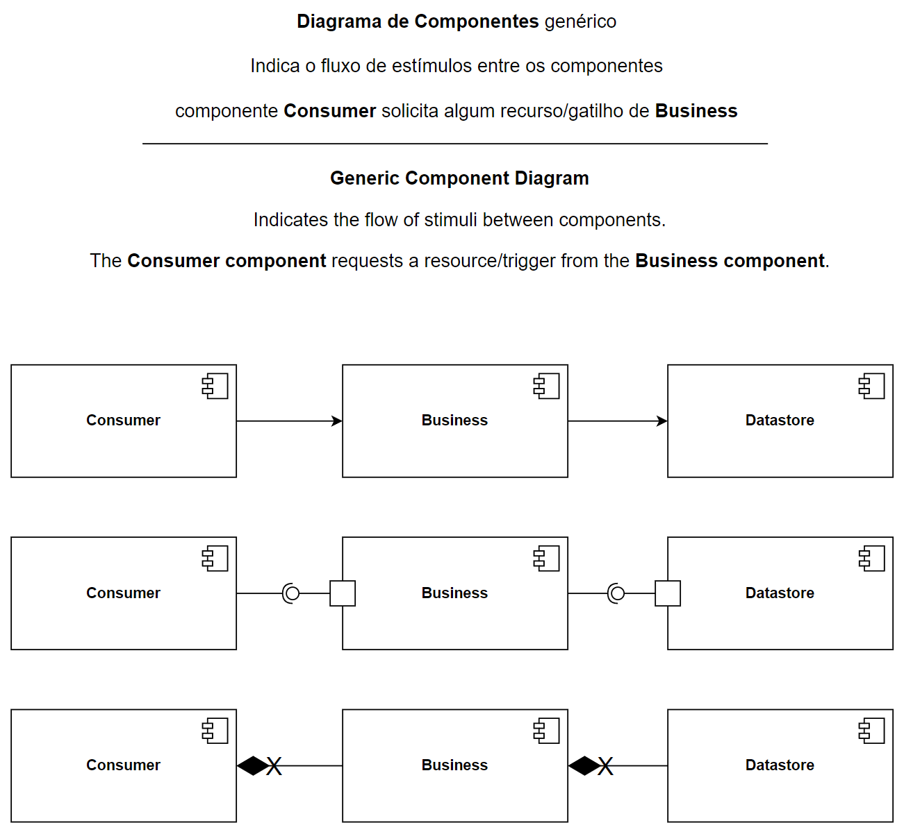
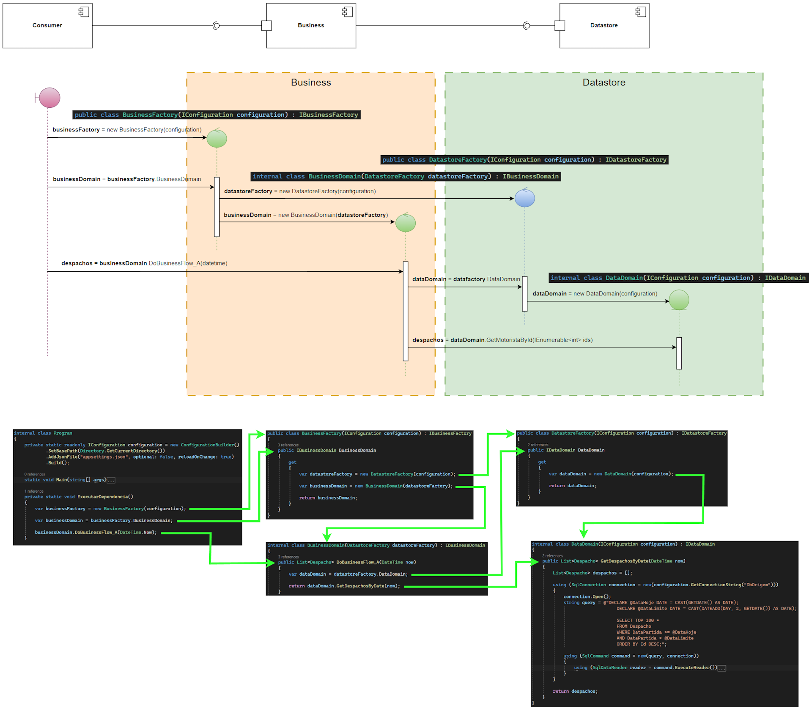
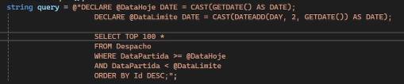
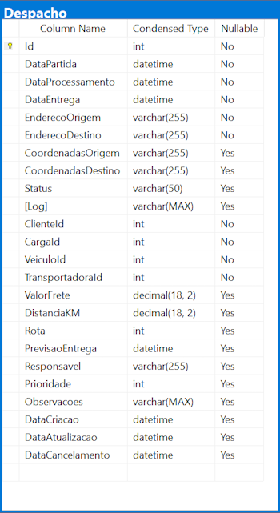

# rame.study.rawcomponent
Estudo para implementação de componentes básica.

Study for Basic Component Implementation

Sem a utilização de injetores de dependência ou frameworks de acesso a dados, a instanciação e injeção de dependências é feita de forma manual em sua forma mais rústica.

Without the use of dependency injectors or data access frameworks, the instantiation and dependency injection are performed manually in their most rudimentary form.

Este modelo apresenta os fundamentos para implementação em qualquer linguagem de programação, em especial as OOP. Neste estudo temos a utilização de .NET 8 / C#.

This model presents the fundamentals for implementation in any programming language, especially OOP (Object-Oriented Programming). In this study, we use .NET 8 / C#.

A sequência para o bootstrap das funcionalidades sempre será a mesma independentemente da quantidade de domínios de negócios ou suas funcionalidades.

The sequence for bootstrapping functionalities will always remain the same, regardless of the number of business domains or their functionalities.

The performance test was conducted using ADO.NET and a simple query for benchmarking.

O teste de performance foi realizado utilizando ADO.NET e uma query simples para benchmark.

A entidade e seus campos:

The entity and its fields:

